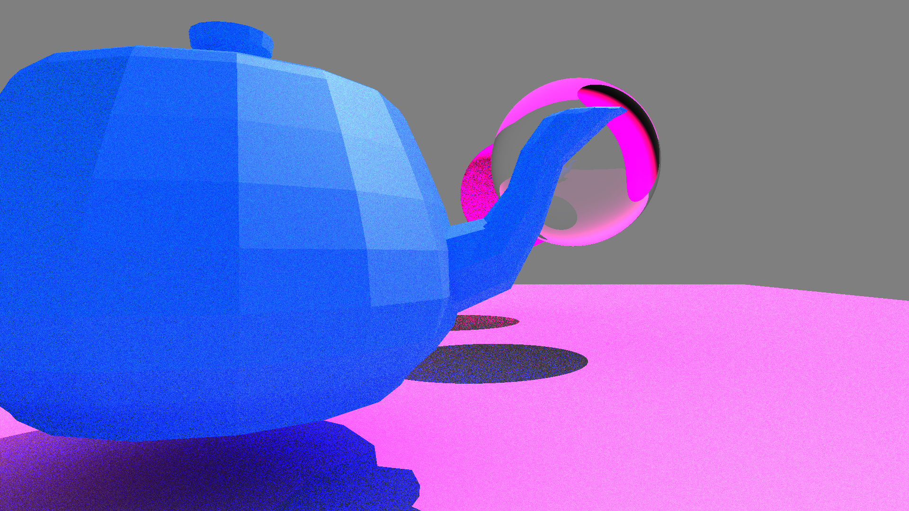

# Raytracer Project Readme

## Screenshots

### Teapot



### Spheres


### Plane


## Overview

This README provides essential information about the Raytracer project, a school assignment for the B4 - Object-Oriented Programming course (B-OOP-400). Raytracer is a program designed to generate images by simulating the path of light as it interacts with various geometries, producing realistic digital images.

## Project Features

Raytracer boasts a range of features, allowing for flexible and extensible ray tracing:

- **Primitives**: Supports basic shapes like spheres and planes.
- **Transformations**: Includes translation capabilities.
- **Lighting**: Handles directional and ambient lighting.
- **Material**: Allows for flat color rendering.
- **Scene Configuration**: Easily configure scenes with primitives, lighting, and cameras.
- **Transformation**: Incorporates rotation features.
- **Shadows**: Supports drop shadows for realistic scenes.
- **More Primitives**: Implement triangles, and .OBJ file support.
- **Advanced Transformations**: Explore scaling, shearing and transformation matrices.
- **Advanced Lighting**: Experiment with multiple directional and point lights, colored lighting, and the Phong reflection model.
- **Advanced Material**: Add transparency, refraction, reflection, and various texturing options, including file-based, procedural chessboard, and Perlin noise texturing.
- **Scene Configuration**: Go further with scene-in-scene importing, antialiasing through supersampling, adaptive supersampling, and various optimization techniques like multithreading.

## Scene Configuration

Configure your scenes using an external file. The provided example demonstrates the structure of scene configuration using the libconfig++ format.

For examples of scene you can find them in the ./scenes folder.

## Libraries

The project makes use of the following libraries:
- libconfig++ (for scene configuration parsing)
- SFML 2.5.1 (for display)
- C++ 20


## Building the Project

To build the project install the dependencies listed above, then run these commands:
```sh
cmake . && make -j
```

A raytracer binary will be created
To run it:
```sh
./raytracer [PATH TO THE SCENE .cfg FILE]
```

## Project Structure

Here's a brief overview of the project structure:

- `./include`: Header files
- `./scenes`: Scene configuration files
- `./screenshots`: Generated image files
- `./shared`: Shared utilities
- `./src`: Source code

## Conclusion

The Raytracer project provides a fantastic opportunity to delve into the world of raytracing and computer graphics. Whether you stick to the mandatory features or push the boundaries to create a photorealistic raytracer, this project allows you to explore the captivating realm of computer graphics and rendering.
